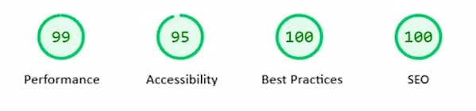
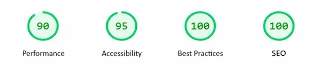

# 🌍 Wanderlust Travels

A full-stack travel agency web application built with React and Node.js. Users can explore destinations, make reservations, and pay securely via Stripe.

**Live Demo:** [wanderlust-travel-agency-three.vercel.app](https://wanderlust-travel-agency-three.vercel.app)

---

## 📸 Screenshots


### Desktop


### Mobile


### Admin Panel
<div align="center">
  
  
  
  
</div>

---

## ✨ Features

- Browse 120+ travel destinations filtered by region
- Reservation form with date picker and group discount (10% for 4+ people)
- Secure payment integration via Stripe
- User authentication (register, login, JWT)
- User profile with booking history and favorite destinations
- Admin panel for managing destinations, reservations, and contact info
- Dynamic contact page with region-based office info
- Fully responsive design optimized for mobile
- Lighthouse scores: Performance 92 · Accessibility 88 · Best Practices 100 · SEO 100

---

## 🛠 Tech Stack

**Frontend**
- React 19 + Vite
- React Router DOM
- React Icons
- Flatpickr (date picker)
- Recharts (admin charts)
- CSS Modules

**Backend**
- Node.js + Express
- MongoDB + Mongoose
- JWT Authentication
- Stripe API

**Deployment**
- Frontend: Vercel
- Backend: Vercel Serverless

---

## 🚀 Getting Started

### Prerequisites

- Node.js 18+
- MongoDB Atlas account
- Stripe account

### Installation

1. Clone the repository
```bash
git clone https://github.com/yourusername/wanderlust-travel-agency.git
cd wanderlust-travel-agency
```

2. Install server dependencies
```bash
npm install
```

3. Install client dependencies
```bash
cd client
npm install
```

4. Create a `.env` file in the root directory
```env
MONGODB_URI=your_mongodb_connection_string
JWT_SECRET=your_jwt_secret
STRIPE_SECRET_KEY=your_stripe_secret_key
STRIPE_WEBHOOK_SECRET=your_stripe_webhook_secret
CLIENT_URL=http://localhost:5173
```

5. Create a `.env` file in the `client/` directory
```env
VITE_API_URL=http://localhost:3000
VITE_STRIPE_PUBLIC_KEY=your_stripe_public_key
```

### Running the App

```bash
# Run backend (from root)
npm run dev

# Run frontend (from client/)
cd client
npm run dev
```

---

## 📁 Project Structure

```
wanderlust-travel-agency/
├── client/                  # React frontend
│   ├── public/
│   │   └── images/          # Static assets
│   └── src/
│       ├── components/      # React components
│       │   ├── Home/
│       │   ├── Destinations/
│       │   ├── Contact/
│       │   ├── About/
│       │   ├── Navbar/
│       │   ├── Footer/
│       │   ├── AdminPanel/
│       │   └── Profile/
│       └── pages/
│           ├── Booking.jsx
│           └── BookingSuccess.jsx
└── server/                  # Express backend
    ├── models/              # Mongoose models
    ├── routes/              # API routes
    ├── middleware/          # Auth middleware
    └── server.js
```

---

## 🔑 Environment Variables

| Variable | Description |
|---|---|
| `MONGODB_URI` | MongoDB connection string |
| `JWT_SECRET` | Secret key for JWT tokens |
| `STRIPE_SECRET_KEY` | Stripe secret key |
| `STRIPE_WEBHOOK_SECRET` | Stripe webhook secret |
| `CLIENT_URL` | Frontend URL for CORS |
| `VITE_API_URL` | Backend API URL |
| `VITE_STRIPE_PUBLIC_KEY` | Stripe publishable key |

---

## 👤 Author

Developed by **Begüm Narmanlı**

---

## 📄 License

This project is for portfolio purposes.