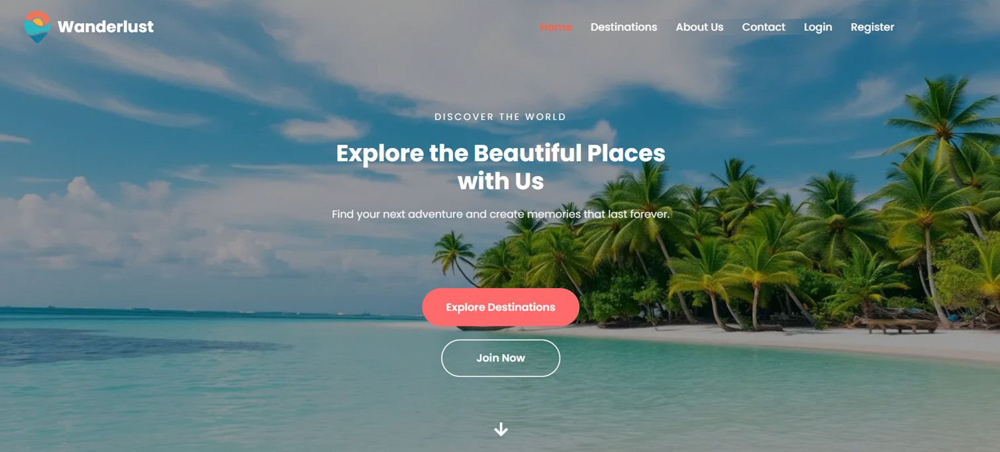
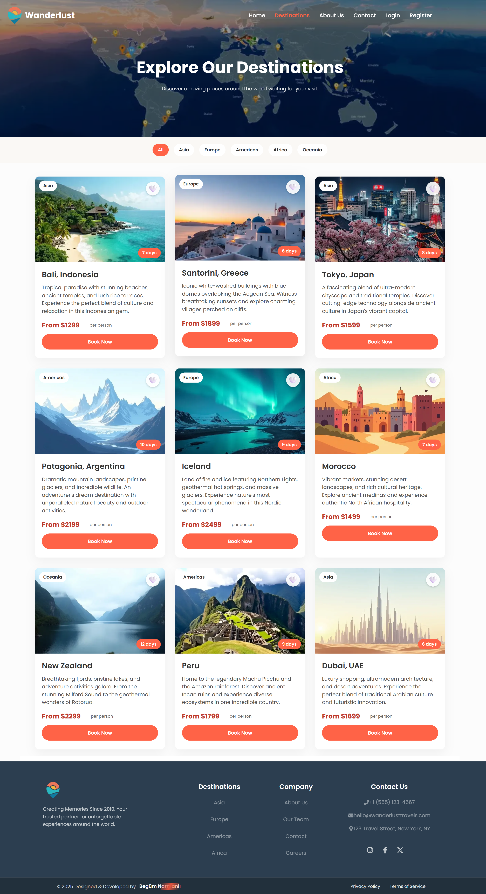
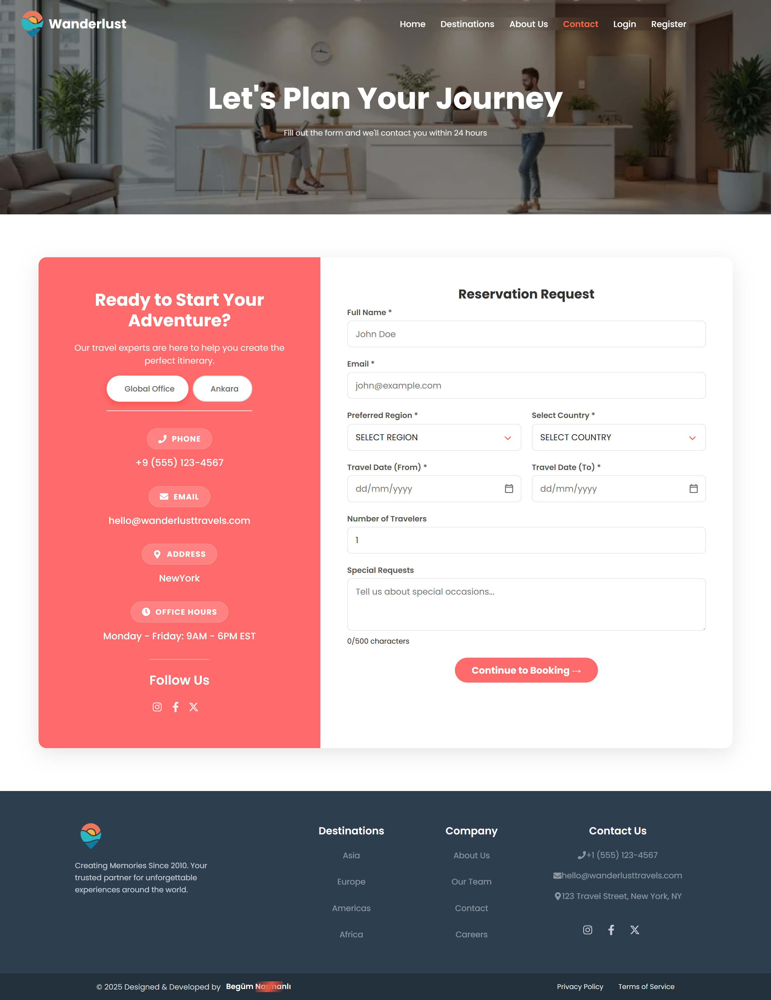
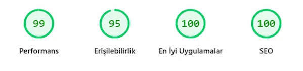
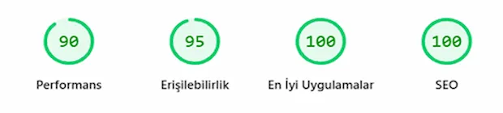
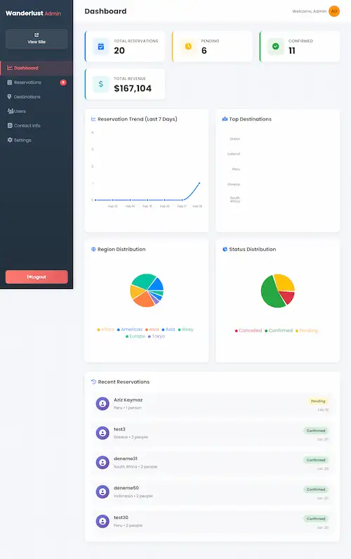
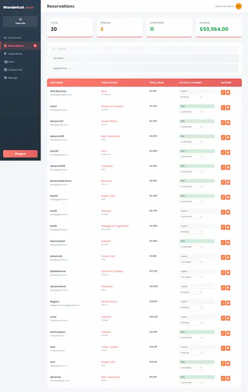
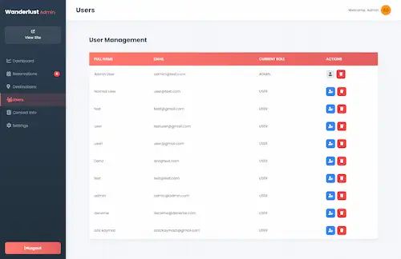
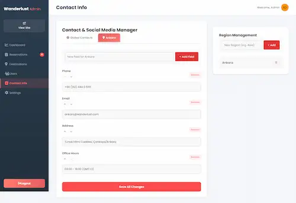

# 🌍 Wanderlust Travels

React ve Node.js ile geliştirilmiş full-stack bir seyahat acentesi web uygulaması. Kullanıcılar destinasyonları keşfedebilir, rezervasyon yapabilir ve Stripe üzerinden güvenli ödeme gerçekleştirebilir.

**Canlı Demo:** [wanderlust-travel-agency-three.vercel.app](https://wanderlust-travel-agency-three.vercel.app)

---

## 📸 Ekran Görüntüleri





### Masaüstü


### Mobil


### Admin Paneli
<div align="center">
  
  
  
  
</div>

---

## ✨ Özellikler

- 120+ seyahat destinasyonunu bölgeye göre filtreleyerek keşfetme
- Tarih seçici ve grup indirimi (%10, 4+ kişi) ile rezervasyon formu
- Stripe üzerinden güvenli ödeme entegrasyonu
- Kullanıcı kimlik doğrulama (kayıt, giriş, JWT)
- Rezervasyon geçmişi ve favori destinasyonları içeren kullanıcı profili
- Destinasyon, rezervasyon ve iletişim bilgisi yönetimi için admin paneli
- Bölgeye göre ofis bilgisi gösteren dinamik iletişim sayfası
- Mobil için optimize edilmiş tam responsive tasarım
- Lighthouse skorları: Performans 92 · Erişilebilirlik 88 · En İyi Uygulamalar 100 · SEO 100

---

## 🛠 Teknoloji Yığını

**Frontend**
- React 19 + Vite
- React Router DOM
- React Icons
- Flatpickr (tarih seçici)
- Recharts (admin grafikleri)
- CSS Modules

**Backend**
- Node.js + Express
- MongoDB + Mongoose
- JWT Kimlik Doğrulama
- Stripe API

**Deployment**
- Frontend: Vercel
- Backend: Vercel Serverless

---

## 🚀 Kurulum

### Gereksinimler

- Node.js 18+
- MongoDB Atlas hesabı
- Stripe hesabı

### Adımlar

1. Repoyu klonlayın
```bash
git clone https://github.com/yourusername/wanderlust-travel-agency.git
cd wanderlust-travel-agency
```

2. Server bağımlılıklarını yükleyin
```bash
npm install
```

3. Client bağımlılıklarını yükleyin
```bash
cd client
npm install
```

4. Root dizininde `.env` dosyası oluşturun
```env
MONGODB_URI=mongodb_bağlantı_stringi
JWT_SECRET=jwt_gizli_anahtar
STRIPE_SECRET_KEY=stripe_gizli_anahtar
STRIPE_WEBHOOK_SECRET=stripe_webhook_gizli
CLIENT_URL=http://localhost:5173
```

5. `client/` dizininde `.env` dosyası oluşturun
```env
VITE_API_URL=http://localhost:3000
VITE_STRIPE_PUBLIC_KEY=stripe_public_anahtar
```

### Uygulamayı Çalıştırma

```bash
# Backend'i çalıştır (root dizininden)
npm run dev

# Frontend'i çalıştır (client/ dizininden)
cd client
npm run dev
```

---

## 📁 Proje Yapısı

```
wanderlust-travel-agency/
├── client/                  # React frontend
│   ├── public/
│   │   └── images/          # Statik dosyalar
│   └── src/
│       ├── components/      # React bileşenleri
│       │   ├── Home/
│       │   ├── Destinations/
│       │   ├── Contact/
│       │   ├── About/
│       │   ├── Navbar/
│       │   ├── Footer/
│       │   ├── AdminPanel/
│       │   └── Profile/
│       └── pages/
│           ├── Booking.jsx
│           └── BookingSuccess.jsx
└── server/                  # Express backend
    ├── models/              # Mongoose modelleri
    ├── routes/              # API rotaları
    ├── middleware/          # Auth middleware
    └── server.js
```

---

## 🔑 Ortam Değişkenleri

| Değişken | Açıklama |
|---|---|
| `MONGODB_URI` | MongoDB bağlantı stringi |
| `JWT_SECRET` | JWT token gizli anahtarı |
| `STRIPE_SECRET_KEY` | Stripe gizli anahtarı |
| `STRIPE_WEBHOOK_SECRET` | Stripe webhook gizli anahtarı |
| `CLIENT_URL` | CORS için frontend URL'i |
| `VITE_API_URL` | Backend API URL'i |
| `VITE_STRIPE_PUBLIC_KEY` | Stripe yayınlanabilir anahtarı |

---

## 👤 Geliştirici

**Begüm Narmanlı** tarafından geliştirilmiştir.

---

## 📄 Lisans

Bu proje portfolyo amaçlıdır.